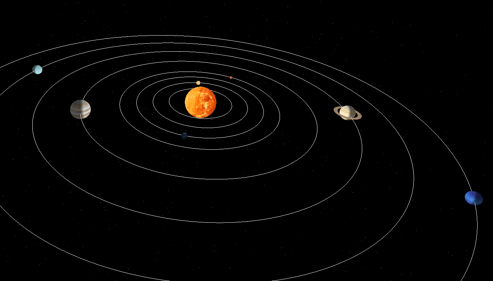
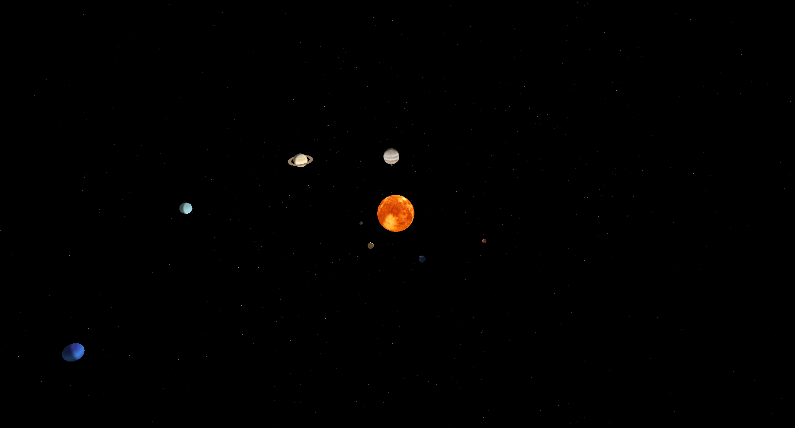
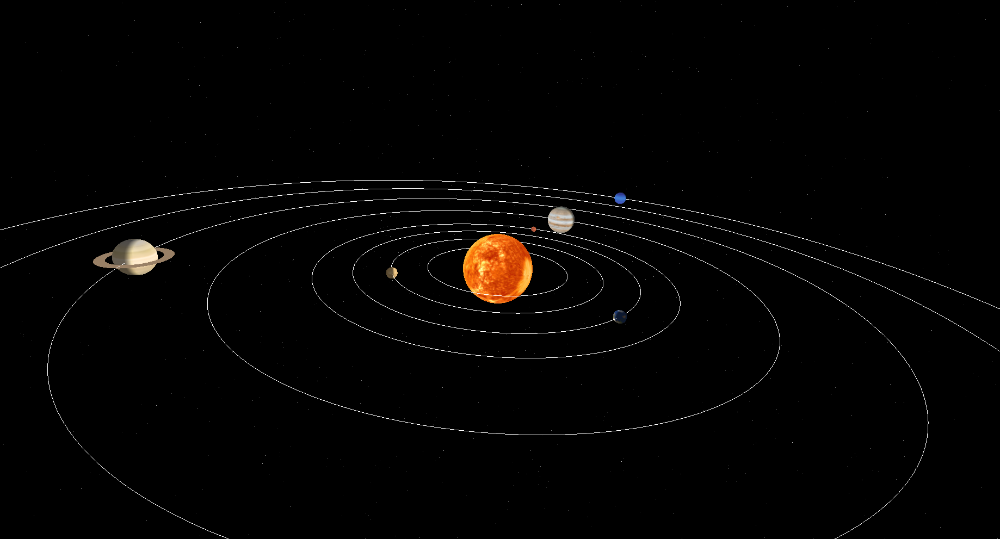

# Simulador de Sistema Solar 3D em OpenGL


Este projeto consiste em uma simulação interativa e tridimensional do Sistema Solar, desenvolvida como projeto prático para a disciplina de **Computação Gráfica** na **UFPB**. A implementação utiliza **C++** e **OpenGL** para explorar conceitos fundamentais como modelagem de objetos, transformações geométricas, iluminação dinâmica e mapeamento de texturas.

---

## O que o código faz?

A aplicação renderiza um modelo dinâmico do sistema planetário, integrando as seguintes funcionalidades:

* **Dinamismo Orbital:** Cada planeta possui movimentos independentes de rotação (eixo próprio) e translação, utilizando **curvas paramétricas** para definir as trajetórias circulares.
* **Realismo Visual:** Implementação de iluminação global e uma luz pontual centralizada no Sol (`GL_LIGHT0`), conferindo profundidade e sombreamento aos corpos celestes.
* **Mapeamento de Texturas:** Uso da biblioteca `stb_image` para aplicar mapas de textura reais (diffuse maps) em esferas, representando fielmente a aparência de cada astro.
* **Ambiente Imersivo:** Um campo estelar (skybox) gerado proceduralmente com algoritmos de cintilação e inclusão de elementos extras, como os anéis de Saturno.
* **Controle de Oclusão:** Uso rigoroso do **Z-buffer** (`GL_DEPTH_TEST`) para garantir que a renderização respeite a sobreposição correta dos objetos no espaço 3D.
* **Visualização Flexível:** Opção de exibir ou ocultar as linhas das órbitas para melhor análise das trajetórias.

--

## Imagens da simulação





---

## Controles da Simulação

A interação com o ambiente virtual é feita em tempo real através do teclado:

| Tecla | Ação |
| :---: | :--- |
| **Z / z** | Controla o Zoom (Aproximar ou Afastar a visualização) |
| **W / S** | Ajusta a elevação da câmera (Altura) |
| **A / D** | Rotaciona a câmera manualmente ao redor do Sol |
| **P** | Pausa ou retoma o movimento de translação e rotação |
| **O** | Alterna a visibilidade das linhas das órbitas |
| **ESC** | Encerra a aplicação |

---

## Elementos por Atividade Prática

O projeto foi construído seguindo os requisitos evolutivos da disciplina:

* **Aula 01:** Configuração do ambiente GLUT, gerenciamento de janelas e callbacks de exibição.
* **Aula 02:** Implementação de câmera dinâmica com `gluLookAt` e projeção perspectiva.
* **Aula 03:** Algoritmos de visibilidade (Z-buffer) e separação de objetos de cena.
* **Aula 04:** Sistema de iluminação com componentes ambiente e difusa; uso de `GL_EMISSION` para o Sol.
* **Aula 05:** Carregamento de texturas externas e configuração de Mipmaps para suavização.
* **Aula 06:** Lógica de órbitas baseada em funções paramétricas de seno e cosseno.


---

## Desafios e Soluções

1.  **Equilíbrio de Iluminação:** Ajustar os materiais para que o brilho do Sol fosse proporcional, permitindo que os planetas fossem iluminados corretamente sem perder os detalhes das texturas.
2.  **Balanceamento de Escalas:** Organizar os raios das órbitas para evitar colisões visuais entre as esferas, mantendo uma composição estética funcional.
3.  **Navegação 3D:** Configurar a perspectiva e os controles de câmera para garantir que o usuário mantivesse uma boa visão geral do sistema em qualquer ângulo.

---


## Como Executar

1.  Certifique-se de ter o **FreeGLUT** e um compilador C++ configurados em sua máquina.
2.  Mantenha as texturas na pasta `/texturas` e as imagens de demonstração na pasta `/imagens`.
3.  Compilação via terminal (Exemplo GCC no Linux):
    ```bash
    g++ sistema_solar.cpp -lglut -lGLU -lGL -o sistema_solar
    ./sistema_solar
    ```

---
## Integrantes e Atividades

* **Wesley Alves da Silva:** Desenvolvimento da lógica gráfica (planetas, sol, estrelas e orbitas) e mapeamento (rotação e translação).
* **Maristela de Freitas Riquelme:** Definição e esquema de iluminação e movimentação da cena.
* **Arthur Henrique de Carvalho Damasceno:** Configuração da câmera e aplicação de textura.
   